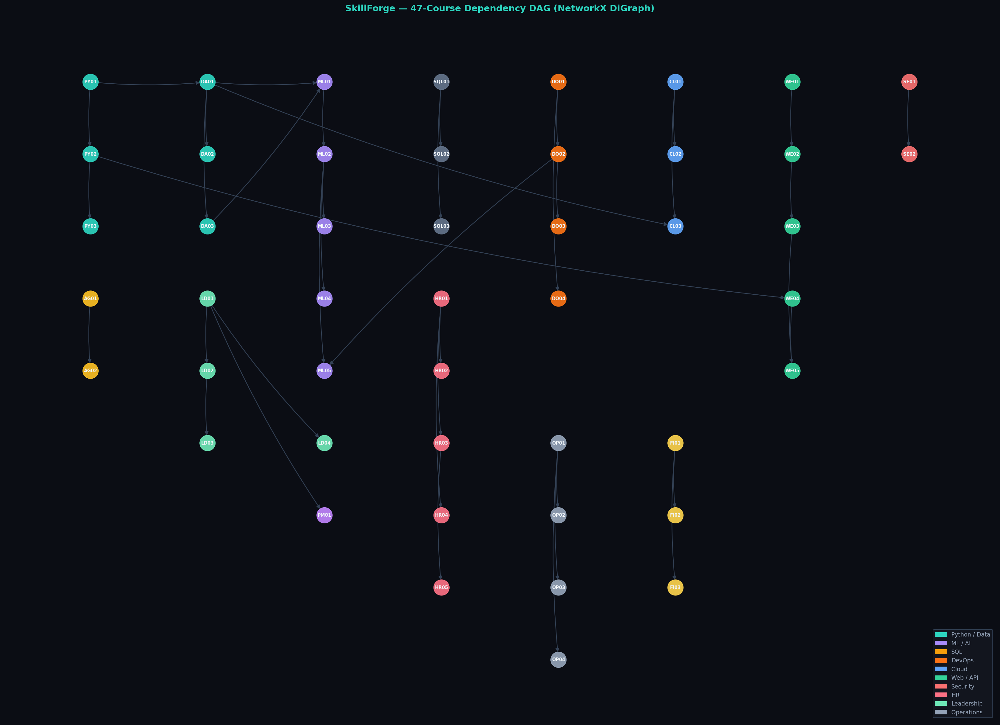

# SkillForge ⚡ — AI Adaptive Onboarding Engine

> Intelligent skill-gap analysis and personalised learning pathway generation — powered by Groq LLaMA 3.3-70b, NetworkX DAG, sentence-transformers, and a fully deterministic adaptive algorithm.

## 🚀 Live Demo

**Try it now → [skill-forge-345.streamlit.app](https://skill-forge-345.streamlit.app/)**

No setup needed. Click any demo scenario on the landing page for instant results.

**📹 Demo Video → [Watch on Google Drive](https://drive.google.com/file/d/1dzOV292Z8zhcYhXy_l8U_rs0G9uezaP6/view?usp=sharing)**

---

## The Problem

Corporate onboarding is broken. Everyone gets the same curriculum regardless of what they already know. Experienced hires waste time on concepts they mastered years ago. Beginners get overwhelmed by advanced modules out of sequence.

## The Solution

Upload a **resume PDF** + **job description**. SkillForge:

1. Parses every skill with proficiency score (0–10) and year last used
2. Applies a **skill decay model** — `prof × max(0.5, 1 − years_unused/5)` — so stale skills don't inflate match scores
3. Classifies every JD skill as **Known / Partial / Missing** against the candidate profile
4. Builds a **dependency-aware learning roadmap** using a 47-node NetworkX DAG with topological sort
5. Detects the **critical path** using node-weighted dynamic programming (required-JD-skill nodes = 10×, prereq-only = 1×)
6. Auto-injects **LD01/LD02/LD03** leadership modules when a seniority gap is detected
7. Generates a **2-sentence AI reasoning trace** per module via a dedicated Groq call
8. Scores **interview readiness** from required skill coverage
9. Audits the resume for **ATS compliance** and rewrites it without fabricating experience

---

## Demo Scenarios

| Scenario | What it tests |
|---|---|
| 💻 Junior SWE → Mid Full Stack | Long roadmap, many missing skills, seniority gap injection |
| 🧠 Senior DS → Lead AI | Skill decay on NLP/MLOps, strategic modules, high starting fit |
| 👔 HR Coordinator → Manager | Non-tech domain, people management, leadership injection |

---

## Architecture

```
Resume (PDF / DOCX / Image) + Job Description
              │
              ▼
     ┌─────────────────┐
     │   File Parser   │  pdfplumber · python-docx · base64 image
     │                 │  scanned-PDF → PyMuPDF rasterise (2× zoom) → Llama 4 Scout vision OCR
     └────────┬────────┘
              │
              ▼
     ┌─────────────────────────────────────┐
     │   Groq LLM Extraction               │
     │   LLaMA 3.3-70b-versatile (text)    │
     │   Llama 4 Scout 17B (vision/images) │
     │   3-tier fallback + regex scanner   │
     └────────┬────────────────────────────┘
              │
              ▼
     ┌──────────────────────────────────────┐
     │  Three-Layer Skill Matcher           │
     │  1. 30+ alias mappings               │
     │  2. Substring / token overlap        │
     │  3. Cosine similarity ≥ 0.52         │
     │     (all-MiniLM-L6-v2 via SBERT)    │
     │  + 82 compiled regex fallback rules  │
     │  + Skill Decay Model                 │
     └────────────┬─────────────────────────┘
                  │
                  ▼
     ┌──────────────────────────────────────┐
     │      Adaptive Path Generator         │
     │   NetworkX 47-node DiGraph           │
     │   topological sort · ancestors()     │
     │   Node-weighted DP critical path     │
     │   Seniority gap → LD injection       │
     └──────────────┬───────────────────────┘
                    │
                    ▼
     ┌──────────────────────────────────────┐
     │   Streamlit UI — 5 tabs              │
     │   Gap Analysis · Roadmap + ROI       │
     │   Interview Prep · Research · ATS    │
     └──────────────────────────────────────┘
```

---

## Dependency Graph — NetworkX DAG

The 47-course catalog is modelled as a **directed acyclic graph**. Arrows show prerequisite relationships. Topological sort guarantees foundational modules always appear before advanced ones.



**Color key:** Teal = Python/Data · Purple = ML/AI · Amber = SQL · Orange = DevOps · Blue = Cloud · Green = Web/API · Pink = HR · Mint = Leadership

The adaptive path generator walks this graph using `nx.ancestors()` to pull all required prerequisites, then runs `nx.topological_sort()` on the induced subgraph to determine the correct learning order.

---

## Adaptive Algorithm — Logic Detail

```
1. Classify all JD skills as Known / Partial / Missing
   → Apply skill decay: prof × max(0.5, 1 − years_unused/5)
   → Three-layer matching: alias dict → substring → cosine ≥ 0.52

2. Collect catalog modules for all Missing + Partial gap skills

3. Walk NetworkX ancestors() to pull prerequisite modules
   → Skip prereq if candidate already has proficiency ≥ 6
   → MERN Stack → auto-expands to React + JavaScript + REST APIs

4. Build induced subgraph of all needed modules
   → topological_sort() guarantees foundational-first ordering

5. Node-weighted DP for critical path:
   required_skill_node weight = 10
   prereq_only_node weight    = 1

6. Seniority mismatch → inject LD01 / LD02 / LD03 leadership modules

7. Separate Groq call per module: 2-sentence personalised reasoning trace
```

---

## Tech Stack

| Layer | Technology |
|---|---|
| **UI Framework** | Streamlit ≥ 1.35.0 |
| **LLM — Text** | Groq API — LLaMA 3.3-70b-versatile |
| **LLM — Vision** | Groq API — Llama 4 Scout 17B (meta-llama/llama-4-scout-17b-16e-instruct) |
| **Skill Matching** | sentence-transformers all-MiniLM-L6-v2 · cosine similarity ≥ 0.52 |
| **Regex Fallback** | 82 compiled patterns — SQL, Docker, K8s, NLP, CI/CD, MERN, vector DBs |
| **Alias Mapping** | 30+ canonical mappings (JS → JavaScript, MERN → React+JS+REST APIs) |
| **Dependency Graph** | NetworkX ≥ 3.3 — DiGraph, topological sort, ancestor traversal |
| **PDF Parsing** | pdfplumber + PyMuPDF (scanned PDF rasterisation at 2× zoom) |
| **Charts** | Plotly ≥ 5.20 — animated radar, ROI bar, timeline, salary benchmark |
| **PDF Export** | reportlab |
| **Calendar Export** | ICS/iCal — 1 session/day · 7 PM · weekdays only |
| **Web Search** | ddgs (DuckDuckGo) — live salary, trends, course links |
| **Concurrency** | ThreadPoolExecutor for parallel web searches |
| **Caching** | shelve-based hash cache (MD5 keyed by resume + JD) |

---

## Datasets & Model Citations

| Resource | Source | Usage |
|---|---|---|
| Resume Dataset | [Kaggle — snehaanbhawal](https://www.kaggle.com/datasets/snehaanbhawal/resume-dataset/data) | Resume parsing validation and testing |
| O\*NET Skills DB | [onetcenter.org](https://www.onetcenter.org/db_releases.html) | Occupational skills taxonomy reference |
| Job Descriptions | [Kaggle — kshitizregmi](https://www.kaggle.com/datasets/kshitizregmi/jobs-and-job-description) | JD parsing and skill extraction testing |
| LLaMA 3.3-70b-versatile | Meta via Groq API | Skill extraction, ATS audit, reasoning traces |
| Llama 4 Scout 17B | Meta via Groq API | Vision OCR — image resumes and scanned PDFs |
| all-MiniLM-L6-v2 | Hugging Face (SBERT) | Semantic skill matching, cosine similarity |

---

## Internal Validation Metrics

| Metric | Value | How it's measured |
|---|---|---|
| Hallucinations | 0 | Every recommended module ID is validated against the 47-course catalog before output |
| Role fit score | Live % | Computed from known/partial/missing skill counts — shown as current → projected in UI |
| Per-module reasoning | ✓ | Dedicated Groq LLM call per module — 2-sentence trace shown in Roadmap tab |
| Cosine match threshold | ≥ 0.52 | `sklearn.metrics.pairwise.cosine_similarity` on all-MiniLM-L6-v2 embeddings |
| Regex fallback rules | 82 | Compiled `re` patterns covering all major tech stacks |
| Catalog grounding | 100% | `CATALOG_BY_ID` lookup — no free-text course names ever generated |

---

## Project Structure

```
SkillForge/
├── main.py          ← Streamlit UI — 5 tabs, rendering, session state, resume validation
├── backend.py       ← Core logic: AI pipeline, DAG, skill matching, charts, web search
├── dag.png          ← NetworkX DAG visualization (47-course dependency graph)
├── .env             ← GROQ_API_KEY=gsk_... (never committed)
├── .gitignore
├── requirements.txt
├── Dockerfile
└── README.md
```

---

## Setup

### Prerequisites
- Python 3.9+
- Free Groq API key → [console.groq.com](https://console.groq.com)

```bash
git clone https://github.com/Sarika-stack23/Skill-Forge.git
cd Skill-Forge
pip install -r requirements.txt
echo "GROQ_API_KEY=gsk_your_key_here" > .env
streamlit run main.py
```

Opens at **http://localhost:8501**

### Docker

```bash
docker build -t skillforge .
docker run -p 8501:8501 -e GROQ_API_KEY=gsk_your_key_here skillforge
```

---

## Requirements

```
streamlit>=1.35.0
groq>=0.9.0
pdfplumber>=0.10.0
python-docx>=1.1.0
python-dotenv>=1.0.0
plotly>=5.20.0
networkx>=3.3
reportlab>=4.0.0
sentence-transformers>=2.7.0
scikit-learn>=1.4.0
numpy>=1.26.0
ddgs>=9.0.0
```

Optional — for scanned PDF vision OCR:
```
PyMuPDF>=1.23.0
Pillow>=10.0.0
```

---

## UI Output Tabs

| Tab | What it shows |
|---|---|
| **Gap Analysis** | Known/Partial/Missing skill cards · animated radar chart · transfer advantages · salary benchmark |
| **Roadmap** | Dependency-ordered modules · critical path · AI reasoning per module · ROI ranking · timeline |
| **Interview Prep** | AI questions calibrated to candidate seniority · per-skill readiness · talking points |
| **Research** | Live salary data · job market insights · skill demand signals · web search · course finder |
| **ATS & Export** | Resume quality scores · rewrite · PDF / JSON / CSV / ICS calendar download |

---

*Built with Groq · NetworkX · Streamlit · sentence-transformers*